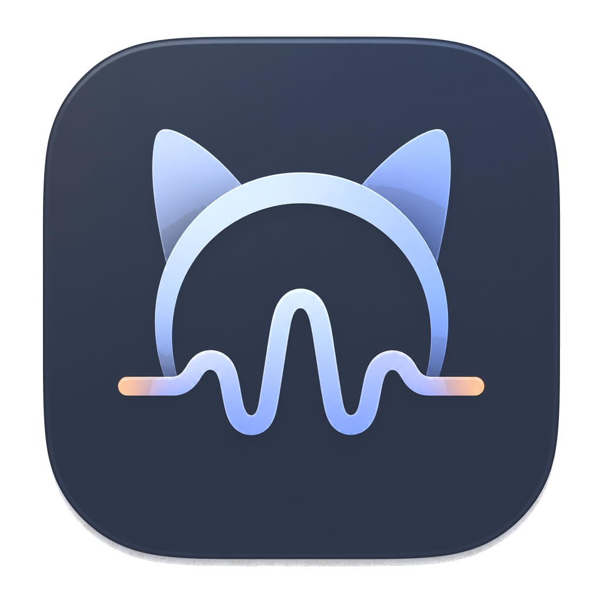
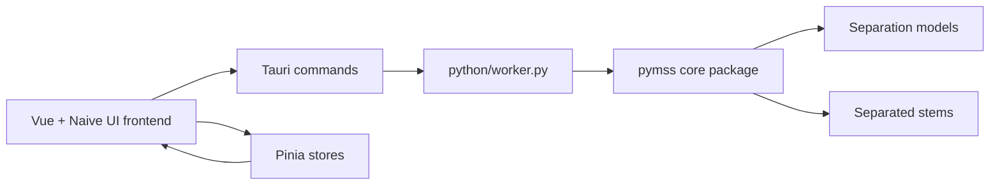

<!-- markdownlint-disable MD013 MD033 MD041 -->

<p align="center">
  
</p>

<h1 align="center">Pymss Studio</h1>

<p align="center">
  A polished desktop workspace for music source separation, model management, batch jobs, and stem editing.
</p>

<p align="center">
  
  
  
</p>

<p align="center">
  <a href="./README.zh-CN.md">简体中文</a>
  ·
  <a href="https://github.com/pymss-project/pymss-studio/releases">Download</a>
  ·
  <a href="https://github.com/pymss-project/pymss">pymss core</a>
</p>

<p align="center">
  
  
  
  
</p>

<p align="center">
  
</p>

## Why Pymss Studio

Pymss Studio turns the [`pymss`](https://github.com/pymss-project/pymss) source-separation engine into a complete desktop experience. It gives producers, researchers, and power users a single place to prepare models, import audio, monitor long-running separation tasks, review results, and export edited stems without dropping into command-line workflows.

> The desktop app is a wrapper around the external `pymss` package. Core separation algorithms and model behavior live in `pymss`; this repository focuses on the desktop product, frontend workflow, Tauri orchestration, and release packaging.

## Install

Download the latest Windows, Linux, or macOS package from the [Pymss Studio releases page](https://github.com/pymss-project/pymss-studio/releases).

On macOS, clear the quarantine attribute after installing the app:

```bash
xattr -cr '/Applications/Pymss Studio.app'
```

Then open Pymss Studio from `/Applications`.

## Advantages

Pymss Studio focuses on practical desktop performance across more machines:

- Faster inference workflows through a packaged desktop runtime around `pymss`.
- Lower memory pressure for day-to-day source separation and batch jobs.
- Broader platform coverage across Windows, Linux, and macOS.

## Preview

| Light | Dark |
| --- | --- |
|  |  |
|  |  |
|  |  |
|  |  |
|  |  |

## Highlights

| Area | What it does |
| --- | --- |
| Workspace dashboard | Shows runtime health, local model status, running jobs, completed results, and the recommended workflow. |
| Separation setup | Imports audio/video files or folders, chooses a downloaded model, configures output format, runtime device, TTA, debug logging, and advanced inference parameters. |
| Task queue | Tracks queued and running jobs with stage-level progress, logs, retry/cancel actions, and history management. |
| Model library | Browses available models, downloads and resumes model files, deletes local models, and manages storage cleanup. |
| Results and projects | Keeps generated outputs and editor projects organized for review and later editing. |
| Stem editor | Provides waveform preview, transport controls, asset panels, mix controls, project persistence, missing-asset relinking, and export. |
| Desktop packaging | Uses Tauri v2 with a Python worker and release scripts for portable Python runtimes. |

## Roadmap

Near-term work:

- Intel GPU and AMD GPU adaptation. Developers with Intel or AMD GPUs are welcome to join `pymss-project` and help with validation, packaging, and performance tuning.
- iOS and Android GPU inference.

Long-term work:

- iOS and Android NPU inference.

## Tech stack

| Layer | Stack |
| --- | --- |
| Frontend | Vue 3, TypeScript, Vite, Pinia, Vue Router, Vue I18n, Naive UI |
| Desktop shell | Tauri v2, Rust, Tauri dialog/shell/store plugins |
| Worker | Python worker protocol in `python/worker.py` |
| Core engine | External [`pymss`](https://github.com/pymss-project/pymss) package |
| Packaging | pnpm, Tauri CLI, PowerShell runtime staging scripts, GitHub Actions |

## Prerequisites

- Node.js with `pnpm@10.33.2`
- Rust and Cargo for Tauri development
- Python for worker development
- A local `pymss` checkout or `PYMSS_STUDIO_PYMSS_PATH` pointing to one
- Platform-specific media/model dependencies required by the `pymss` core package

The worker resolves `pymss` in this order:

```text
PYMSS_STUDIO_PYMSS_PATH
<workspace>/pymss-desktop + <workspace>/pymss as sibling repositories
<portable-root>/pymss in release builds
```

## Development

Install dependencies:

```bash
pnpm install
```

Run the frontend only:

```bash
pnpm dev
```

Run the full desktop app with Tauri:

```bash
pnpm tauri dev
```

Build the frontend:

```bash
pnpm build
```

Build the production desktop app:

```bash
pnpm tauri build
```

## Configuration

Runtime data is stored under a single data root. The app derives `settings/`, `models/`,
`outputs/`, `editor-projects/`, `logs/`, and `temp/` from that root.

Data root selection order:

1. `PYMSS_STUDIO_DATA_ROOT`, when set.
2. `./data` in development builds.
3. `data` next to the executable for Windows release builds that include a
   `pymss-studio.portable` marker file next to the executable.
4. `~/.pymss-studio` for regular installed release builds.

| Variable | Default | Description |
| --- | --- | --- |
| `PYMSS_STUDIO_DATA_ROOT` | see above | Explicit root directory for settings, models, outputs, projects, logs, and temp files. |
| `PYMSS_STUDIO_PYTHON` | `python` | Python interpreter used by the Tauri backend to launch the worker. |
| `PYMSS_STUDIO_PYMSS_PATH` | auto-detected | Explicit path to the external `pymss` core repository/package. |
| `PYMSS_STUDIO_DEFAULT_OUTPUT_DIR` | app default | Default directory for separation outputs. |

## Project layout

```text
.
├── src/                  # Vue frontend: views, components, stores, i18n, editor UI
├── src-tauri/            # Tauri v2 app, Rust commands, bundle configuration
├── python/               # JSON-based worker protocol and runtime dependency notes
├── scripts/              # Runtime preparation, staging, and cleanup scripts
├── installer/            # Windows installer assets
├── images/               # README screenshots
└── package.json          # Frontend and Tauri commands
```

## Architecture



The UI owns interaction design and state. Tauri owns desktop integration, process orchestration, file dialogs, and packaged resources. The Python worker exposes model, environment, audio, and inference operations through a JSON protocol while delegating separation logic to `pymss`.

## Release packaging

Windows releases are built in CUDA and CPU variants. The release flow prepares an embedded Python runtime, builds the Tauri executable, stages the portable directory with worker/core assets and tools, then produces archives or installers.

```powershell
./scripts/prepare-python-runtime.ps1 -Variant cuda
./scripts/prepare-python-runtime.ps1 -Variant default
```

Staged builds are smoke-tested with worker commands such as `env_info` and `list_models`.

## Verification

This repository currently has no dedicated automated test suite. Use the existing build and smoke checks before shipping changes:

```bash
pnpm build
pnpm tauri build
```

For packaged Python environments, verify:

```bash
python python/worker.py env_info
python python/worker.py list_models
```

## License

Pymss Studio is licensed under the GNU Affero General Public License v3.0. See [LICENSE](./LICENSE).
